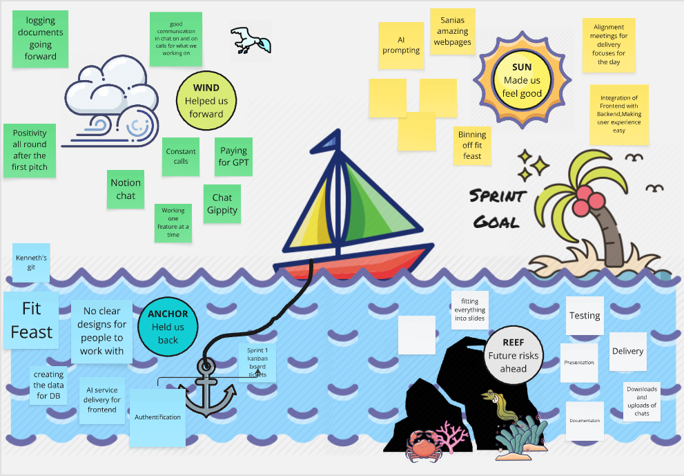
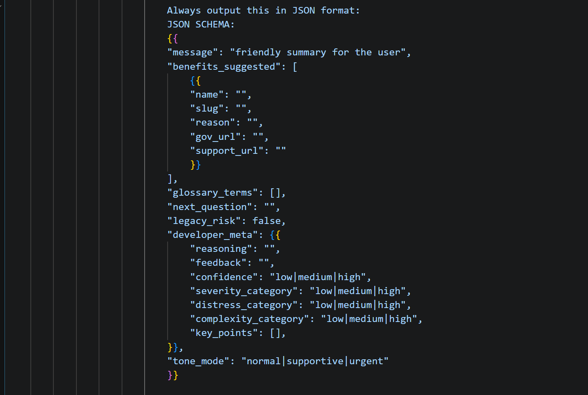

# 

> Making benefits simple, clear and accessible.

---

## Contents

- [Project Overview](#-project-overview)
- [Installation & Setup](#-installation--setup)
- [How to Use](#-how-to-use)
- [Technologies Used](#-technologies-used)
- [Process](#-process)
- [Significant Code Snippet](#-significant-code-snippet)
- [Key Features](#-key-features)
- [Screenshots](#-screenshots)
- [Wins & Challenges](#-wins--challenges)
- [Known Issues](#-known-issues)
- [Future Improvements](#-future-improvements)
- [Contributions](#-contributions)
- [Useful Resources](#-useful-resources)
- [Notes](#-notes)

## Project Overview

Benefit buddy is a web app designed to help people understand what UK governement income benefits they might be entitled to.

A huge amount of support goes unclaimed every year, not because dont need it but because the system is confusing and hard to navigate. We want to build something that simplifies that experience.

With Benefit Buddy, users can:

- Find help and get guidence though a easy to use chatbot
- Explore a Help page with FAQ's and a glossary
- View clear benefit information in an easy to ready format
- Access and apply for benefits through the offical GOV.UK links

The aim is to make the process feel less overwhelming and more approachable.

---

## Installation and Setup

Clone the repository: <link here>

Navigate into the project:
`cd benefit-buddy`

install dependencies:
`npm install`

Create a `.env` file in the root directory and add:
- `# environment`
    - `NODE_ENV=`
    - `PORT=`
    - `BASE_URL=`
- `Secrets`
    - `DB_URL=`
    - `AI_API_KEY=`
    - `GEMINI_API_KEY=`
    - `OPENAI_API_KEY= `

Then run the server `npm run dev`

---

## How to use 

- Go to `http://localhost:3000`
- Use the chatbot to explore benefits
- Visit the Help page to:
    - Read FAQ's
    - Look up key words in the glossary
    - Browse benefit cards

---

## Technology used 

- JavaScript
- Node.js
- Express.js
- PostgreSQL
- Open AI API

---

## Process

We worked in an Agile approach across three short sprints.

- Used a kanban board to manage tasks and layout the individual sprints
- Broke the app into clear features (chatbot, help page, data layer)
- Designed a structured dataset for benefits
- Constant communication with clear daily goals
- Having retrosepctives to reflect on the progress made.

Trello board: [Trello board](https://trello.com/b/wADNauey/benefit-buddy)

---

## Significant code 

### AI response shape
The following image shows the required feilds of response when someone interacts with the chatbot. The reason we made it like this is to give back the most appropiate response possible. Although the chatbot will most likely be used mostly in regards to income benefits and how to apply for them

## Key Features

- **Chatbot** - guides users one question at a time to help them understand what benefits apply to them and give them the support they need

- **Help page** - FAQ's and glossary to find help users find out what commonly asked questions there are so they can get a quick response. And a glossary to help users understand key terms that they otherwise may not know.

- **Benefits Finder** - Simple cards taht give information of benefits in a simple way along with a link to GOV.UK offical website if they wanted to apply.

- **Direct Links** - Using offical links to GOV.UK and Citizens advice inside the chatbot alongside the hlp page so users can easily find the officail page they need to apply/read up on a benefit.

---

## Screenshots

<!-- add home page, help page, benefits page, chatbot page -->
---

### Wins
- Integration of Frontend and backend early 
- Displaying demo pages early 
- Alignment meetings for delivery focus for the day
- Constant refinement of scope and the slow introduction of strecth goals

### Challenges
- A lot of time used to see if login/sign up feature is applicable for this app
- Some waiting for other people to complete tasks in order to finsih another task
- Some git issues with API keys
---

## Known issues

---

## Future improvements

---

## Contributions

1. Fork the Repository
2. Create a branch (`feature/your-feature`)
3. Edit changes or add your own
4. Add these changes `git add (file/folder updated)`
5. Use git status to see that the changes have been added `git status`
6. Commit those changes `git commit -m 'your changes'`
7. Use git status again to see that they have been committed
8. Push to your branch `git push origin feature/your-feature`  
9. Open a Pull Request 

## Useful resources

- [GOV.UK Benefits](https://www.gov.uk/browse/benefits)
- [Citizens Advice](https://www.citizensadvice.org.uk/)
- [Turn2Us](https://www.turn2us.org.uk/)

---

## Notes

--- 

## Badges

